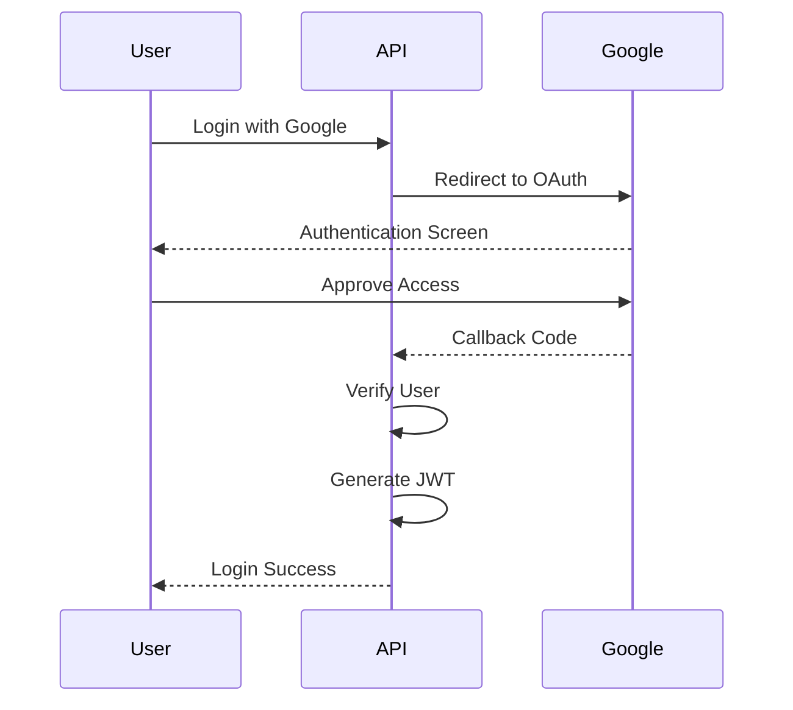

# 🌟 Prompt-Flow AI

A modern, portfolio-grade full-stack SaaS platform designed for **Prompt Engineers, Developers, Content Creators, and Marketers**. Prompt-Flow AI helps users create, improve, organize, analyze, and share AI prompt templates through a beautiful and intuitive interface powered by Google Gemini AI.

---

## 🚀 Live Demo

- 🌐 **Live Demo:** [https://prompt-flow-three-alpha.vercel.app]
- 💻 **Repository:** [https://github.com/OnikTechHub/Prompt-Flow]
---

# 📖 Overview

Prompt-Flow AI bridges the gap between basic prompts and production-ready AI instructions.

Instead of writing prompts from scratch every time, users can:

- ✨ Generate prompts using AI
- 🚀 Improve existing prompts
- 📂 Organize prompts into collections
- 🌍 Share templates with the community
- 📊 Monitor prompt performance using analytics
- ❤️ Save favorite prompts
- 🔍 Search prompts by category, tags, and difficulty

The application follows a modern SaaS architecture with a separate **Next.js frontend** and **Express.js backend**.

---

# ✨ Features

## 🤖 AI Workspace

Generate AI content using the official Google Gemini SDK.

- Prompt generation
- Content refinement
- AI assistance
- Real-time responses

---

## ✨ AI Prompt Improver

Transform simple prompts into professional prompts.

Example:

Input:

> "Write a blog"

Output:

> "Write a 1000-word SEO-friendly blog about modern React development with headings, bullet points, FAQs, and a conclusion."

---

## 🌍 Community Gallery

Browse prompts shared by the community.

Features:

- Search
- Categories
- Tags
- Difficulty filters
- Likes
- Public sharing

---

## 📊 Analytics Dashboard

Beautiful charts powered by Recharts.

Track:

- Prompt usage
- AI generations
- Popular categories
- Most viewed prompts
- Success rate
- User activity

---

## 🔐 Authentication

Secure authentication using:

- Google OAuth 2.0
- Passport.js
- JWT
- bcryptjs

---

## 🎨 Premium UI

Modern UI includes:

- Responsive design
- Glassmorphism
- Dark mode
- Beautiful gradients
- Animated cards
- Custom toast notifications
- Smooth transitions

---

# 🛠 Tech Stack

| Category | Technology |
|------------|------------|
| Frontend | Next.js 16 (App Router) |
| UI | React 19 |
| Styling | Tailwind CSS v4 |
| Charts | Recharts |
| Backend | Express.js |
| Runtime | Node.js |
| Authentication | Passport.js + JWT |
| Password Hashing | bcryptjs |
| Database | MongoDB |
| ODM | Mongoose |
| AI | Google Gemini API (@google/genai) |

---

# 📂 Project Structure

```text
Prompt-Flow-AI/
│
├── src/
│   ├── app/
│   ├── components/
│   ├── context/
│   ├── hooks/
│   ├── lib/
│   └── utils/
│
├── server/
│   ├── config/
│   ├── controllers/
│   ├── middleware/
│   ├── models/
│   ├── routes/
│   ├── services/
│   └── utils/
│
├── public/
├── package.json
└── README.md
```

---

# 🚀 Getting Started

## 1️⃣ Prerequisites

Make sure you have installed:

- Node.js v18+
- MongoDB (Atlas or Local)
- Google AI Studio API Key

---

## 2️⃣ Clone Repository

```bash
git clone https://github.com/yourusername/prompt-flow-ai.git

cd prompt-flow-ai
```

---

## 3️⃣ Install Frontend

```bash
npm install
```

---

## 4️⃣ Install Backend

```bash
cd server

npm install
```

---

# ⚙ Environment Variables

## Frontend (.env.local)

```env
NEXT_PUBLIC_API_URL=http://localhost:5000/api

NEXT_PUBLIC_GOOGLE_CLIENT_ID=

NEXT_PUBLIC_GEMINI_API_KEY=
```

---

## Backend (.env)

```env
PORT=5000

MONGO_URI=

JWT_SECRET=

GOOGLE_CLIENT_ID=

GOOGLE_CLIENT_SECRET=

CLIENT_URL=http://localhost:3000

GEMINI_API_KEY=
```

---

# ▶ Running the Application

## Backend

```bash
cd server

npm run dev
```

---

## Frontend

```bash
npm run dev
```

Visit:

```
http://localhost:3000
```

---

# 🔐 Authentication Flow



---

# 📊 Dashboard Features

✔ Total Prompts

✔ AI Generations

✔ Views

✔ Likes

✔ Favorites

✔ Category Distribution

✔ Monthly Activity

✔ Prompt Performance

---

# 🌍 Community Features

- Publish Prompt
- Edit Prompt
- Delete Prompt
- Like Prompt
- Favorite Prompt
- Share Prompt
- Search Prompt
- Filter Prompt
- User Profiles

---

# 🚀 Deployment

## Frontend

Deploy using **Vercel**

```bash
npm run build
```

---

## Backend

Deploy using **Render**

Root Directory

```
server
```

Build Command

```bash
npm install
```

Start Command

```bash
npm start
```

---

## Database

Use **MongoDB Atlas**

---

# 📸 Screenshots

Add screenshots here.

```
Home Page

Dashboard

AI Workspace

Community Gallery

Analytics
```

---

# 🔮 Future Improvements

- AI Chat Assistant
- Team Collaboration
- Prompt Marketplace
- Folder Management
- Version History
- AI Prompt Scoring
- Export Prompt (PDF / Markdown)
- AI Cost Tracking
- Prompt Collections
- Notifications

---

# 🤝 Contributing

Contributions are welcome!

1. Fork the project

2. Create a feature branch

```bash
git checkout -b feature-name
```

3. Commit your changes

```bash
git commit -m "Added new feature"
```

4. Push

```bash
git push origin feature-name
```

5. Open a Pull Request

---

# 👨‍💻 Author

**Your Name**

- Portfolio: https://onikdas-dev.vercel.app
- LinkedIn: https://www.linkedin.com/in/onik-das
- GitHub: https://github.com/OnikTechHub

---

# 📄 License

This project is licensed under the **MIT License**.

---

# ⭐ Support

If you found this project helpful, please consider giving it a ⭐ on GitHub.
